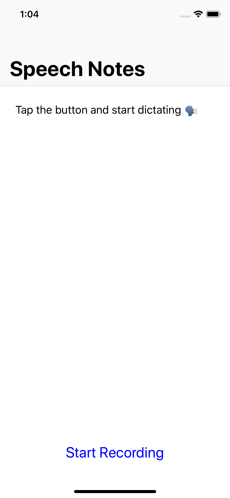

# SpeechNotes

This is a demo iOS application that shows how to use
[SFSpeechRecognizer](https://developer.apple.com/documentation/speech/sfspeechrecognizer)
to record what a user says and transcribe it into text.

